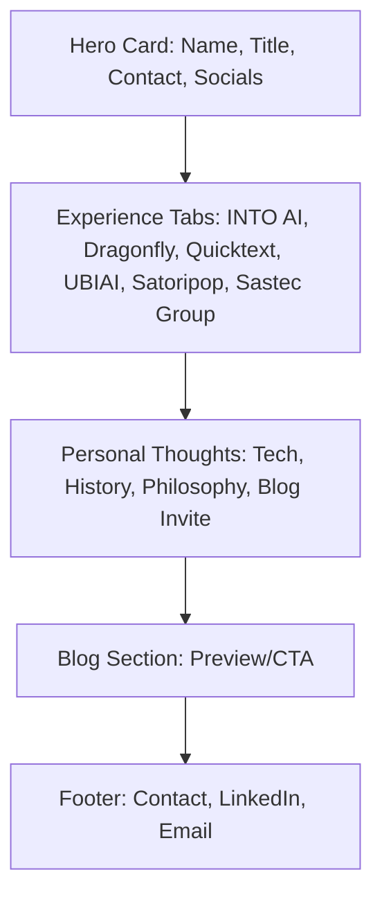

# Portfolio Homepage & Blog Redesign Plan

## 1. Homepage Structure & Content

### a. Hero Card
- Name, title, location, and a short, strong intro (from your summary, tailored for hiring managers).
- Contact info (email, LinkedIn).
- Tech badges (Next.js, Node.js, Django, React, etc.) styled for a dark, modern look.

### b. Experience Tabs
- Each tab: Company name, logo, and a concise, achievement-focused summary (no internships).
    - INTO AI
    - Dragonfly
    - Quicktext
    - UBIAI
    - Satoripop
    - Sastec Group
- Each summary will highlight your impact, tech stack, and value to teams.

### c. Personal Thoughts Section
- Short, human reflection on the fast pace of tech, your love for history/philosophy, and a segue to the blog.
- Tone: authentic, insightful, not corny, fits the tech-dark vibe.

### d. Blog Section
- CTA to visit the blog, matching the homepage’s style.
- Blog page will have a short intro and list posts (starting fresh).

### e. Footer
- Contact info, LinkedIn, and email for easy reach.

---

## 2. Blog Page
- Consistent dark, modern theme.
- Short intro about your blog’s focus (tech, personal insights, etc.).
- List of posts (starting fresh, but ready for new content).

---

## 3. SEO Optimization
- Use Next.js Head component for meta tags (title, description, Open Graph, Twitter).
- Semantic HTML (h1, h2, nav, main, section, footer).
- Accessible, descriptive alt text for images/logos.
- Structured data (JSON-LD) for personal/professional schema.
- Fast loading, mobile responsive, and clean URLs.

---

## 4. Page Cleanup
- Delete `app/about/page.tsx` and `app/portfolio/page.tsx`.
- Remove any navigation or links to these pages.

---

## 5. UI/UX
- All sections styled with a professional, tech-dark theme.
- Use existing UI components (Card, Badge, etc.) for consistency.
- Company logos in tabs (SVG or from a logo library, styled to match theme).
- Smooth scroll and subtle animations for a modern feel.
- **Keep the RetroGrid background as a core visual element.**

---

## 6. Content Drafting
- All new content for the homepage and blog intro, using your provided info and focusing on achievements, clarity, and appeal to hiring managers.

---

## Notes
- Only homepage and blog pages will remain.
- All design and content will be tailored to be professional, human, and appealing to hiring managers, with no corny or generic filler.
- The RetroGrid background will be preserved as a signature visual element.